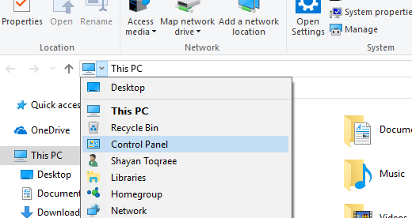

به نام او

# توضیحات

یه برنامه‌ای وجود داره به اسم [AutoHotkey](https://autohotkey.com/)، باهاش می‌شه کلیدای کیبورد رو بهشون چیزای مختلف اختصاص داد. خیلی هم امکانات داره و تقریباً هر کاری می‌شه باهاش کرد.

این اسکریپت با AutoHotkey نوشته شده و می‌تونه یه سری شورتکات خوب به کیبوردتون اضافه کنه.

## مشکل ۱: نبودن علامتای معروف توی کیبورد استاندارد فارسی

-  توی کیبورد استاندارد فارسی یه سری علامتای خیلی معروف مثل @ و # وجود ندارن. این خیلی توی نوشتن اذیت می‌کنه. مثلاً وقتی می‌خوای کسی رو منشن کنی، یا مثلاً وقتی می‌خوای با MarkDown هدر بنویسی.
-  این اسکریپت به جز برای ۵ و ۷ که «،» و «٪» هستن، بقیه‌ی علامتا رو به همون علامتای کیبورد انگلیسی  تغییر می‌ده.

## مشکل ۲: سخت بودن تغییر زبان

-  سخت بودن تغییر زبان مشکلیه که موقع نوشتن متن‌های دوزبانه خیلی اذیت می‌کنه.
-  این اسکریپت دکمه‌ی بی‌کاربرد `CapsLock` رو به این کار اختصاص می‌ده. با زدن `CapsLock`، بین زبان‌ها می‌تونید بچرخید. (البته `CapsLock` رو هم می‌تونید روشن و خاموش کنید!)
-  یه چیز دیگه هم این که MarkDown این امکان رو داره که کد‌هامون رو بین `` ` `` بنویسیم. و ما وقتی داریم به فارسی تایپ می‌کنیم و می‌خوایم کد بنویسیم، باید یه بار `` ` `` رو بزنیم، یه بار هم زبان رو عوض کنیم تا کدمون رو بنویسیم. این اسکریپت می‌تونه دکمه‌ی `` ` `` رو اختصاص بده تا زبان رو هم عوض کنه.

## مشکل ۳: نبودن دکمه‌ی Play/Pause توی بعضی از کیبوردا

-  این اسکریپت `Win+Z` برای رو برای این کار تغییر می‌ده.

## مشکل ۴: خراب بودن شورت‌کات‌های کیبوردی Git Gui

-  این اسکریپت شورت‌کات‌های مورد استفاده‌ی Git Gui مثل `Ctrl+Shift+T` و `Ctrl+Shift+U` و `Ctrl+Shift+I` (که فقط وقتی کار می‌کنن که روی باکس پیام کامیت باشی) رو هم درست می‌کنه.

## مشکل ۵: تقریباً غیر ممکن بودن وارد کردن کاراکتر‌های قالب‌بندی جهت (Directional Formatting Character)

-  وقتی توی Word یا یه ویرایشگر پیشرفته‌ی دیگه متن می‌نویسیم، خودش از روی زبان کیبورد جهت متن وارد شده رو تشخیص می‌ده و قالب‌بندی متن رو درست می‌کنه.
-  ولی وقتی قابلیت‌های قالب‌بندی پیشرفته (مثل Word یا HTML) وجود نداره (مثلاً وقتی جایی کامنت می‌ذاریم، یا توی تلگرام، یا هر جایی که از markdown استفاده می‌شه)، یه سری کاراکتر یونیکد وجود دارن که با استفاده از اونا می‌شه این قالب‌بندی رو انجام داد.
-  استفاده از ویرایشگر‌های پیشرفته...
   -  کلاً هم استفاده کردن از نرم‌افزار‌هایی مثل Word بدی‌های زیادی داره:
      -  حجم فایل خیلی زیاد می‌شه.
      -  به راحتی قابل تبدیل نیست به فرمت‌های دیگه.
      -  نمی‌تونیم راحت متوجه بشیم که ویرایشگر کجای متن داره چه قالب‌بندی‌ای رو پیاده می‌کنه.
      -  اگه یه تعداد فایل داشته باشیم، نمی‌شه راحت توشون جستجو کرد.
      -  نرم‌افزار‌های ویرایشگر سنگین و کندن (مخصوصاً وقتی حجم فایل زیاد می‌شه).
      -  گیت نمی‌تونه خوب روی فایلا کار کنه.
   -  می‌شه گفت که تنها وقتی که Word چیز خوبیه، برای پرینت کردن یا تولید فایل PDFه.
   -  اگه استفاده کردن از این کاراکتر‌ها رو یاد بگیریم و از یه چیزی شبیه markdown استفاده کنیم، زندگی خیلی ساده‌تر می‌شه.
-  این کاراکترا نامرئی‌ن، و فقط طرز نمایش رو تغییر می‌دن.
-  نکته: این کاراکترا فقط داخل **یه** پاراگراف کار می‌کنن و از یه پاراگراف به پاراگراف بعدی ریست می‌شن.
-  چهار دسته کاراکتر قالب‌بندی جهت وجود داره:
   -  ‏Mark‌ها: دو تا کاراکتر وجود داره، «Left-to-right mark» و «Right-to-left mark»، صرفاً نقش یه کاراکتر چپ‌به‌راست یا راست‌به‌چپ رو بازی می‌کنن.
      -  خیلی از نرم‌افزار‌های چند‌زبانه، از روی اولین کاراکتر غیر خنثی متن، جهت متن رو تشخیص می‌دن. مثلاً اگه متن با یه کاراکتر فارسی شروع بشه، راست‌چینش می‌کنن و اگه با یه کاراکتر انگلیسی شروع بشه، چپ‌چینش می‌کنن (پیامک هم همین جوریه معمولاً). برای متن‌هایی که مثلاً فارسی‌ن ولی با یه کلمه‌ی انگلیسی شروع می‌شن، می‌شه یه LRM یا RLM اول متن بذاریم تا جهتش درست بشه.
      -  همچنین اگه بخوایم وسط یه متن فارسی یه همچین چیزی بنویسیم: «Apple،‏ Orange و Banana» (امتحان کنید و بنویسید، اولین کلمه و دومین جاشون کلمه عوض می‌شه و ویرگول هم جای بدی قرار می‌گیره)، می‌تونیم جلوی ویرگول یه RLM بذاریم تا بفهمه که این‌ها سه تا تیکه‌ی چپ‌به‌راستن وسط یه متن راست‌به‌چپ (نه دو تا تیکه).
   -  ‏Embeddingها: باهاشون می‌شه یه تیکه از متن رو چپ‌به‌راست یا راست‌به‌چپ کرد.
      -  ‏LRE و RLE یه embedding چپ‌چین یا راست‌چین رو شروع می‌کنن. و یه کاراکتر «Pop Directional Formatting» هم وجود داره که embedding رو تموم می‌کنه.
      -  یه کاری که با embedding‌ها می‌شه کرد اینه که اول هر پاراگراف بذاریمشون تا جهت پاراگرافمون درست بشه (توی برنامه‌هایی که راست‌چین پشتیبانی نمی‌کنن).
   -  ‏Isolate‌ها: همون کار embedding‌ها رو انجام می‌دن، فقط یه سری مشکلاتشون رو درست کردن. اما نمی‌شه ازشون استفاده کرد فعلاً، چون تقریباً هیچ نمایش‌دهنده‌ای ازشون پشتیبانی نمی‌کنه (من تا حالا ندیدم). (یا رفتار عجیب و غریب از خودش نشون می‌ده، یا کلاً هیچ کاری نمی‌کنه.)
      -  مثل بالایی LRI و RLI داریم، و یه کاراکتر «Pop Directional Isolate» (که با PDF فرق داره).
      -  یه کاراکتر دیگه هم داره، «First Strong Isolate» که یه isolate رو بدون جهت شروع می‌کنه و برای تعیین جهت، به اولین کاراکتر غیر خنثی نگاه می‌کنه. (اگه نرم‌افزارا از isolate‌ها پشتیبانی می‌کردن، می‌شد اول همه‌ی پاراگرافامون یه FSI بزنیم تا همه‌جا، حتی جا‌هایی که تشخیص راست‌به‌چپ وجود نداره، متنمون درست نمایش داده بشه.)
   -  ‏Override‌ها: خیلی شبیه embedding‌ها هستن، ولی یه فرق بزرگ دارن، کل کاراکتر‌ها رو چپه می‌کنن.
      -  مثلاً اگه وسط یه LRO و یه PDF بنویسید «سلام»، بهتون نشون می‌ده «‭سلام‬» (<- این‌جا واقعاً از LRO و PDF استفاده شده).
      -  کاراکتر «Pop directional formatting» بین embedding و override مشترکه (ولی برای isolate یه کاراکتر دیگه‌س).

# راهنما

## عوض کردن زبان

-  اگه دکمه‌ی `CapsLock` رو بزنید بین زبان‌هایی که تعریف شده می‌چرخه.
-  اگه `Shift+CapsLock` رو بزنید، بین کیبورد‌های زبانی که روش هستید می‌چرخه.
-  اگه `Ctrl` سمت راست رو با `CapsLock` بزنید، کیبورد راست‌دست زبانی که روش هستید رو فعال می‌کنه.
-  و اگه `Ctrl` سمت چپ رو با `CapsLock` بزنید، کیبورد چپ‌دست زبانی که روش هستید رو فعال می‌کنه.
-  در ضمن، آخرین کیبوردی که توی هر زبان روش بودید رو یادش می‌مونه و وقتی برمی‌گردید همون رو فعال می‌کنه.
-  نکته: کیبورد‌هایی که انتخاب می‌کنید باید به سیستمتون اضافه شده باشن، وگرنه نمی‌تونه فعالش کنه.

## وارد کردن کاراکتر‌های قالب‌بندی جهت

-  برای Mark‌ها، `CapsLock` رو با فلش سمت راست (RLM) یا چپ (LRM) بزنید.
-  برای Embedding‌ها، `Shift+CapsLock` رو با فلش سمت راست (RLE) یا چپ (LRE) یا بالا (PDF) بزنید.
-  برای Isolate‌ها، `Ctrl+CapsLock` رو با فلش سمت راست (RLI) یا چپ (LRI) یا پایین (FSI) یا بالا (PDI) بزنید.
-  برای Override‌ها، `Alt+CapsLock` رو با فلش سمت راست (RLO) یا چپ (LRO) یا بالا (PDF) بزنید.
-  برای این که قاطی نکنه، اول `CapsLock` رو نگه دارید، بعد `Shift` یا `Ctrl` یا `Alt` رو فشار بدید.
-  می‌تونید جای دکمه‌ی چپ و راست رو توی همه‌ی اینا عوض کنید (به بخش [تنظیمات اولیه‌ی اسکریپت](#initial-config) مراجعه کنید).

## فعال و غیرفعال کردن امکانات

-  برای غیر فعال کردن یا دوباره فعال کردن اصلاح علامت‌های معروف کیبورد فارسی، `CapsLock+\` رو بزنید.
-  برای غیر فعال کردن یا دوباره فعال کردن تغییر زبان با دکمه‌ی `` ` `` از ``CapsLock+`‎ `` استفاده کنید.
-  برای از کار انداختن یا دوباره به کار انداختن دکمه‌ی `Insert` هم از `CapsLock+Insert` استفاده کنید. (فقط خود `Insert` از کار می‌افته و ترکیب‌هاش مثل `Ctrl+Insert` سر جاشون هستن.)
-  از `CapsLock+Tab` هم می‌تونید برای روشن و خاموش کردن خود `CapsLock` استفاده کنید.

## سایر امکانات

-  برای Play یا Pause کردن پلیرتون می‌تونید از `Win+Z` استفاده کنید. (توی بعضی پلیر‌ها باید این رو توی تنظیماتش فعال کنید.)
-  توی Git Gui:
   - از `Ctrl+Shift+T` برای اضافه کردن فایل جاری به ایندکس استفاده کنید.
   - از `Ctrl+Shift+U` برای حذف فایل جاری از ایندکس استفاده کنید.
   - از `Ctrl+Shift+I` برای اضافه کردن همه‌ی تغییرات به ایندکس استفاده کنید.

## تنظیمات اولیه‌ی اسکریپت

-  اگه فایل Config.ahk رو با یه ویرایشگر متنی باز کنید، تنظیمات اسکریپت اون‌جاس. می‌تونید این چیزا رو مشخص کنید:
   - فعال یا غیرفعال بودن شورت‌کات‌های اصلاح شده‌ی Git Gui.
   - فعال یا غیرفعال بودن دکمه‌ی Play/Pause.
   - برعکس کردن دکمه‌ی چپ و راست برای کاراکتر‌های قالب‌بندی جهت.
   - وضعیت اولیه‌ی فعال یا غیر فعال بودن هر کدوم از امکانات.
   - زبان‌هاتون و کیبورد‌های هر کدوم از زبان‌ها.
-  درباره‌ی تغییر دادن زبان‌ها:
-  متغیر `KeyboardsData` داخلش اطلاعات زبان‌ها و کیبورد‌هاتون رو نگه می‌داره. (به خط اول و آخرش دست نزنید.)
-  برای هر زبانی سه دسته کیبورد می‌تونید تعریف کنید:
   - یه دسته کیبورد‌های `Normal` که کیبورد‌های پیش‌فرضن و با `Shift+CapsLock` می‌تونید بینشون بچرخید.
   - دو تا دسته‌ی دیگه هم `Left` و `Right` ن که با `Ctrl+CapsLock` می‌تونید بینشون بچرخید.
-  اگه می‌خواید کیبورد دیگه‌ای اضافه کنید، باید عددش رو بدونید. می‌تونید وقتی اون کیبورد فعاله، `Alt+CapsLock` رو بزنید تا عدد مربوط به کیبوردتون رو نشونتون بده. (فقط نمی‌دونم چرا باید دو بار بزنید! دفعه‌ی اول عدد کیبورد قبلی رو نشون می‌ده، دفعه‌ی دوم عدد کیبورد فعلی رو...!)

## غیر فعال کردن شورت‌کات‌های قدیمی تغییر زبان برای ویندوز ۸ به بعد

-  چون توی ویندوز ۸ به بعد `Win+Space` برای تغییر زبان گذاشته شده (و اگه گیر کنیم می‌تونیم از `Win+Space` استفاده کنیم)، می‌شه شورت‌کات‌های قدیمی ویندوز رو غیرفعال کرد.
-  وارد «Control Panel» بشید. (توی ویندوز ۱۰ می‌تونید یه Windows Explorer باز کنید و توی فلِش پشت آدرس‌بار پیداش کنید.)  
   
-  وارد «Clock, Region and Language» بشید.
-  وارد «Language» بشید. (این‌جا می‌تونید زبان اضافه یا کم کنید.)
-  وارد «Advanced settings» بشید (نوار سمت چپ).
-  توی بخش «Switching input methods»،‏ «Change language bar hot keys» رو بزنید.
-  لیست رو نشونتون می‌ده که می‌تونید تغییرش بدید.

## اجرا شدن موقع شروع ویندوز

-  یه شورتکات از فایل `Main.ahk` به توی پوشه‌ی `Startup` داخل استارت ویندوز اضافه کنید.
-  برای پیدا کردن پوشه‌ی `Startup` می‌تونید این آدرس رو توی آدرس‌بارتون پیست کنید: `%APPDATA%\Microsoft\Windows\Start Menu\Programs\Startup`

